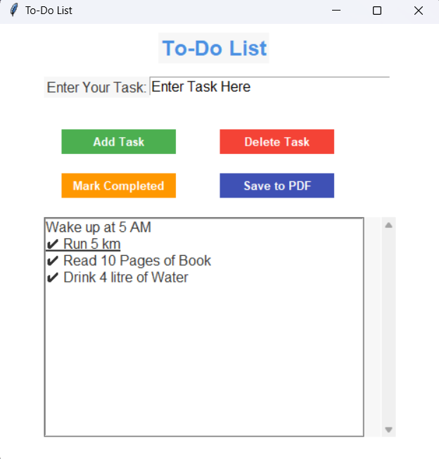

# To_Do_List Application
This is a simple To-Do List application built with Python's Tkinter for GUI and reportlab for PDF generation. The app allows users to manage daily tasks efficiently and save them as a PDF file for reference.
  
<b>Features:</b> 
<b>1 Add Tasks</b>: Enter a task and add it to the list. 
<b>2 Delete Tasks</b>: Remove unwanted tasks from the list. 
<b>3 Mark as Completed</b>: Highlight tasks as completed by marking them with a ✔. 
<b>4 Save to PDF</b>: Export the current task list to a neatly formatted PDF file. 
 
<b>How to Use:</b> 
1 Add a Task: Enter a task in the input field and click "Add Task." 
2 Delete a Task: Select a task from the list and click "Delete Task." 
3 Mark a Task as Completed: Select a task from the list and click "Mark Completed." It will append a ✔ to the task. 
4 Save Tasks to PDF: Click "Save to PDF" to export the tasks to a file named todo_list.pdf in the current directory. 
 

 
<b>System Requirements:</b> 
Python 3.x 
Modules: tkinter, reportlab 
